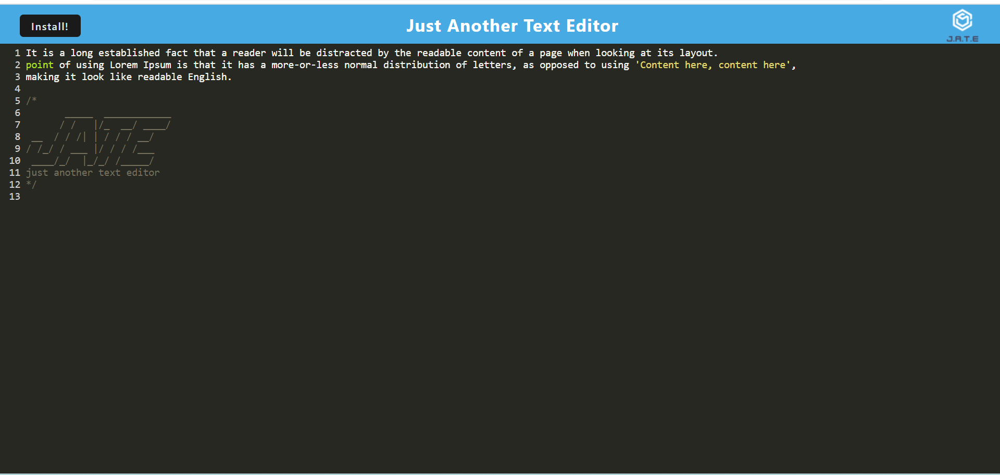
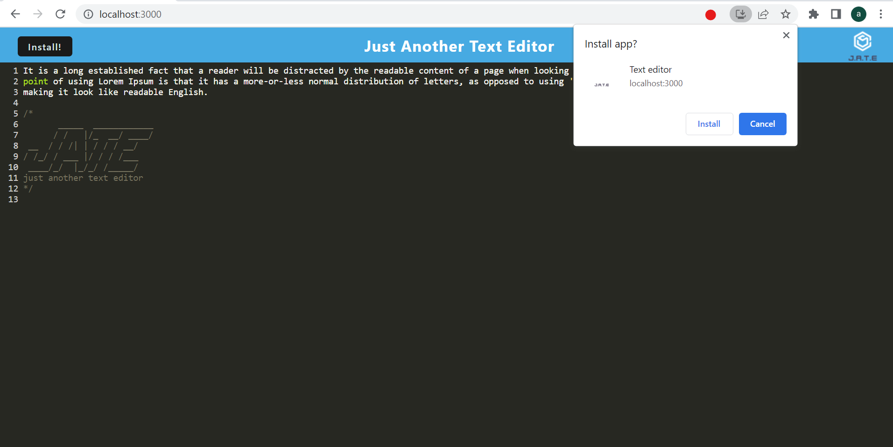

# PWA Texteditor

  

   
  

  ## Description
  This Application allows you to save text input inside of the texteditor, using indexedDB and local storage. the text you enter will be saved even if you lose internet connection.
  the application uses service worker and manifest
  

   

## License
  
    Copyright 2023 Andy316C Licensed under the Apache License, Version 2.0 (the 'License'); you may not use this file except in compliance with the License. You may obtain a copy of the License at http://www.apache.org/licenses/LICENSE-2.0 Unless required by applicable law or agreed to in writing, software distributed under the License is distributed on an 'AS IS' BASIS, WITHOUT WARRANTIES OR CONDITIONS OF ANY KIND, either express or implied. See the License for the specific language governing permissions and limitations under the License.

   
  
  ## Table of contents
  <ol>
  <li><a href='#title'>Title</a></li>
  <li><a href='#desc'>Description</a></li>
  <li><a href='#install'>Installation</a></li>
  <li><a href='#cont'>Contribution</a></li>
  <li><a href='#test'>Testing</a></li>
  <li><a href='#images'>Images</a></li>
  <li><a href='#questions'>Questions</a></li>
  <li><a href='#contact'>Contact Info</a></li>
  </ol>
   

  

  ## Installation
  The application required multiple npm packages for successfull deployment, the pacakages required were express.js, Webpack bundle and also Babel.

  

   

  

  ## Contribution Guidelines
  No contributions needed
  

   

  

  ## Testing
  Open the terminal using the command npm run start, inside your localhost the texteditor will appear. Any text that is entered will be saved in the indexedDB storage in your localhost.
  Enter any text then click out of the screen and the information you entered will be saved. close and open the text editor again and the information will be loaded automatically. you can also install this application on your computer.
  

 
  

   
   

  ## Images
  Starting point, enter any text and it will be saved.
  
   

  Installing the Jate texteditor
  
   
  
  Updating requests, will return the success data. and will return a "Entry Added" if the entry was successfull
  
   
  
  

   
  
  

  
  ## Questions
  
  For questions or information please Email the following email address with your questions or concerns.
   

  Company Name: 
  Global Software CMS INC
   

  Company Email:  
  GlobalSoftwareCMSINC@gmail.com
  

   

  
  ## Contact Info
  Developers Name:  
  Andrew Clark
   

  Developers Email:  
  andy@gmail.com

  

   

 

## Screencastify video link

Click below for the video:

<a href= "https://drive.google.com/file/d/148_TX1_-On5tWOuPlMerwqgd1WZUJdTq/view">walkthrough video </a>

   

  
